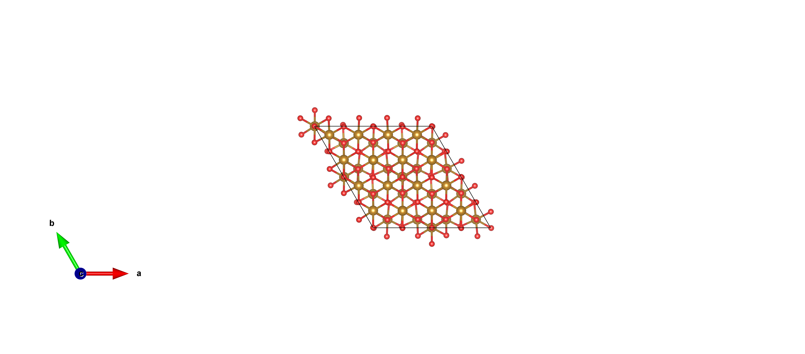

<div align="center">

# CONTCAR-img 🔬🖼️

**一键把 VASP 的 `CONTCAR` / `POSCAR` 转成 `.vesta`，并后台静默导出结构图片**

[](https://www.python.org/)
[](#-环境要求)
[](#-环境要求)
[](LICENSE)
[](#-环境要求)

</div>

---

## 📖 简介

`CONTCAR-img` 是对 [VESTA](https://jp-minerals.org/vesta/) 命令行的轻量封装，用一个 Python 类搞定两件高频小事：

| 功能 | 说明 |
| :--: | :--- |
| **1️⃣ 格式转换** | 把 `CONTCAR` / `POSCAR` 等 VASP 结构文件转换成 VESTA 的 `.vesta` 格式 |
| **2️⃣ 导出图片** | **不调整视角**，按 VESTA 当前视角直接出图，用 `scale` 参数控制图片质量 |

出图时采用 **隐藏窗口的后台模式**（伪无头）：屏幕上不会弹窗，可无人值守批量运行。

<div align="center">
  
  <br>
  <sub>由 <code>examples/CONTCAR</code> 自动生成（<code>scale=3</code>）</sub>
</div>

---

## ✨ 特性

- 🧩 **核心类 `Vesta`**：链式调用，接口简单
- 🔁 **两步合一**：`contcar_to_image()` 一步完成 `CONTCAR → .vesta → PNG`
- 🪟 **后台静默出图**：Windows `SW_HIDE` 隐藏窗口，不打断你的工作
- 🎚️ **可调画质**：`scale` 越大越清晰（`scale=1 → ~90 KB`，`scale=5 → ~950 KB`）
- 📦 **零第三方依赖**：纯 Python 标准库，`miniconda` 任意环境直接跑
- 🗂️ **支持批量**：一条命令处理多个 `CONTCAR`
- 🧭 **可选旋转**：默认不动视角，需要时也可 `rotate={"x": -90}`

---

## 🖥️ 环境要求

| 项目 | 要求 |
| :--- | :--- |
| 操作系统 | Windows（依赖 VESTA 的 GUI/OpenGL 渲染） |
| Python | 3.8+，推荐使用 `D:\miniconda3\envs\chem_env` |
| VESTA | VESTA 64 位版，默认路径 `D:\software\VESTA-win64\VESTA-win64\VESTA.exe` |

> 💡 只用到 Python 标准库，**无需安装任何 pip 包**。

---

## 🚀 快速开始

```bat
:: 1) 克隆仓库
git clone https://github.com/moyulyy/CONTCAR-img.git
cd CONTCAR-img

:: 2) 只做格式转换：CONTCAR -> CONTCAR.vesta
D:\miniconda3\envs\chem_env\python.exe vesta_tools.py examples\CONTCAR --no-image

:: 3) 转格式 + 后台出图（默认隐藏窗口，不调整视角）
D:\miniconda3\envs\chem_env\python.exe vesta_tools.py examples\CONTCAR -o preview.png --scale 5

:: 4) 批量处理多个结构
D:\miniconda3\envs\chem_env\python.exe vesta_tools.py a\CONTCAR b\CONTCAR --scale 3
```

---

## 🧑‍💻 Python API

```python
from vesta_tools import Vesta

# 默认使用说明文档里的 VESTA 路径，且默认隐藏窗口
v = Vesta()

# 功能 1：CONTCAR -> .vesta
v.contcar_to_vesta("examples/CONTCAR")           # -> examples/CONTCAR.vesta

# 功能 2：按当前视角出图（不调整视角），scale 控制质量
v.export_image("examples/CONTCAR.vesta", "a.png", scale=5)

# 一步到位：CONTCAR -> .vesta -> PNG
v.contcar_to_image("examples/CONTCAR", "a.png", scale=5)

# 需要显示 VESTA 窗口时（调试用）
Vesta(show_window=True)

# 需要旋转视角时（默认不旋转）
v.export_image("examples/CONTCAR.vesta", "rot.png", scale=5, rotate={"x": -90})
```

---

## 📚 命令行参数

```text
usage: vesta_tools.py [-h] [-o OUTPUT] [-s SCALE] [--vesta-file VESTA_FILE]
                      [--no-image] [--keep-vesta] [--rotate-x ROTATE_X]
                      [--rotate-y ROTATE_Y] [--rotate-z ROTATE_Z] [--exe EXE]
                      [--timeout TIMEOUT] [--show-window] [-q]
                      contcar [contcar ...]
```

| 参数 | 说明 | 默认值 |
| :--- | :--- | :--- |
| `contcar` | 一个或多个 `CONTCAR` / `POSCAR` 文件 | 必填 |
| `-o, --output` | 输出图片路径（仅单个输入可用） | `<CONTCAR>.png` |
| `-s, --scale` | 图片质量（VESTA `scale` 参数），越大越清晰 | `5` |
| `--vesta-file` | 中间 `.vesta` 文件路径（仅单个输入可用） | `<CONTCAR>.vesta` |
| `--no-image` | 只做格式转换，不出图 | `False` |
| `--keep-vesta` | 出图后保留中间 `.vesta` 文件 | `False` |
| `--rotate-x/y/z` | 绕某轴旋转角度（一般不用，默认不调整） | `None` |
| `--exe` | `VESTA.exe` 路径 | 内置默认路径 |
| `--timeout` | 单个任务超时（秒） | `300` |
| `--show-window` | 显示 VESTA 窗口（默认隐藏） | `False` |
| `-q, --quiet` | 静默模式 | `False` |

---

## 🎚️ `scale` 与画质

`scale` 直接对应 VESTA 的 `-export_img scale=N`，数值越大分辨率越高：

| `scale` | 输出文件大小（示例） | 建议场景 |
| :---: | :---: | :--- |
| `1` | ~90 KB | 快速预览 / 缩略图 |
| `3` | ~440 KB | 网页 / PPT |
| `5` | ~950 KB | 论文插图 |
| `8`+ | 更大 | 印刷级高清图 |

---

## 🧠 实现细节 & FAQ

<details>
<summary><b>为什么不能真正用 <code>-nogui</code> 无头出图？</b></summary>

VESTA 出图依赖 GUI/OpenGL 渲染管线，实测：

| 方式 | 是否出图 | 进程是否自动退出 |
| :--- | :---: | :---: |
| `-nogui -open ... -export_img` | ❌ 不出图 | ✅ 立即退出 |
| `-nogui -i ... -export_img` | ❌ 不出图（挂起） | ❌ |
| GUI + 隐藏窗口（`SW_HIDE`） | ✅ 正常出图 | ❌（轮询后主动结束） |

因此本项目采用 **隐藏窗口的后台模式**：仍然用 GUI 进程渲染，但通过 Windows `STARTUPINFO(SW_HIDE)` 隐藏窗口，做到「不弹窗、无人值守」。
</details>

<details>
<summary><b>为什么成功转换了，VESTA 返回码却是 <code>0xFFFFFFFF</code>？</b></summary>

VESTA 的进程返回码不可靠（转换成功也可能返回 `4294967295`），因此工具**以输出文件是否存在且非空**作为成功判据。
</details>

<details>
<summary><b>为什么导出完图片，VESTA 进程不退出？</b></summary>

图片导出后 VESTA 即使带 `-close` 也不会自动退出。工具会**轮询输出文件、等到大小稳定后主动结束进程**，保证脚本不卡死、无残留进程。
</details>

<details>
<summary><b>能在无用户登录的计划任务/服务里跑吗？</b></summary>

隐藏窗口仍需要 Windows 有可用的交互式桌面/图形会话。在「无用户登录」的场景下 OpenGL 可能不可用，无法保证出图。
</details>

---

## 📁 项目结构

```text
CONTCAR-img/
├── vesta_tools.py          # 核心代码（类 Vesta + 命令行入口）
├── examples/
│   ├── CONTCAR             # 示例输入（VASP 结构文件）
│   └── preview.png         # 示例输出图片
├── README.md
├── LICENSE                 # MIT
└── .gitignore
```

---

## 📄 License

本项目基于 [MIT License](LICENSE) 开源。

> VESTA 为第三方软件，版权归其原作者所有，本项目仅调用其命令行接口。

---

<div align="center">
<sub>如果这个项目帮到了你，欢迎点一个 ⭐ Star！</sub>
</div>

---

<details>
<summary><b>English Summary</b></summary>

**CONTCAR-img** is a tiny Python wrapper around the [VESTA](https://jp-minerals.org/vesta/) command line. It converts VASP `CONTCAR`/`POSCAR` files into VESTA `.vesta` format, and exports structure images **without changing the view**, with the image quality controlled by the `scale` parameter. Image export runs in a **hidden-window background mode** (quasi-headless) so no window pops up.

```python
from vesta_tools import Vesta
v = Vesta()
v.contcar_to_vesta("CONTCAR")                       # -> CONTCAR.vesta
v.contcar_to_image("CONTCAR", "out.png", scale=5)   # -> out.png
```

Requires Windows, Python 3.8+, and VESTA 64-bit. No third-party Python packages needed. Licensed under MIT.

</details>
